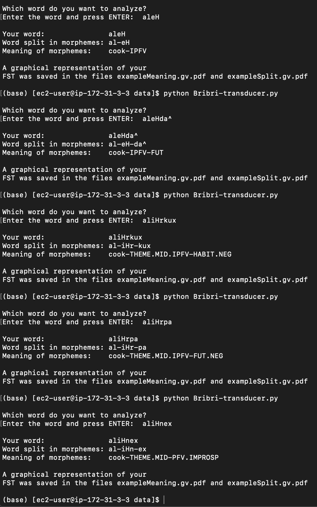

# Bribri Finite State Transducer
Dartmouth College, LING48, Spring 2020
Julian Grunauer (juliang222@gmail.com)
Modified from code provided by Rolando Coto-Solano (Rolando.A.Coto.Solano@dartmouth.edu)

This program uses the openfst and graphviz packages:
http://www.openfst.org/twiki/bin/view/FST/PythonExtension
https://graphviz.readthedocs.io/en/stable/manual.html

The Bribri language is spoken by approximately 3000  
people in southern Costa Rica. It is part of  the Chibchan 
language family, a family with languages in Costa Rica, 
Panama and Colombia. In this small example, you will see 
a transductor that reads BriBri words and decomposes them 
morphologically and denotes the meaning of each morpheme.

Run using virtual machine: ssh -i ling28-2020.pem ec2-user@13.52.231.102

This FSS is coded for all conjugations of the Bribri word
alö́k (to cook).

For example:
* aleH   -> al-eH & cook-IPFV
* ali'   -> al-i' & cook-THEME.PFV.IMPROSP
* alìne -> al-iHn-ex & cook-THEME.MID-PFV.IMPROSP

Morpheme Tree:

Morpheme Meaning Tree:

Sample Output:

